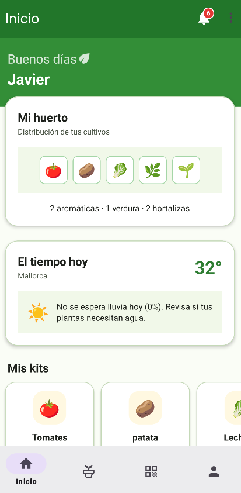
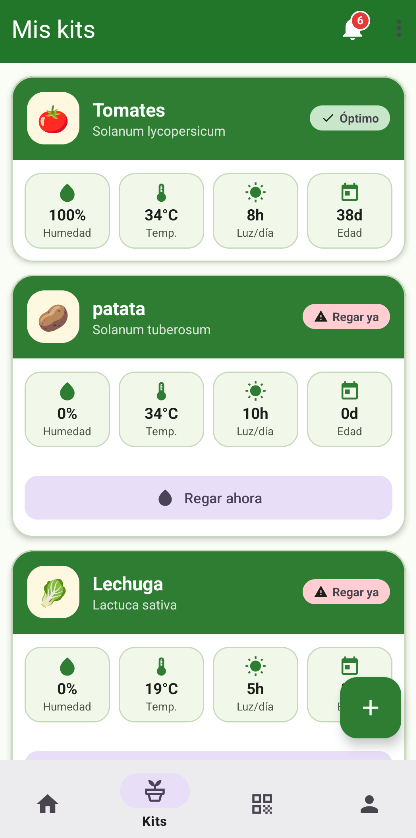
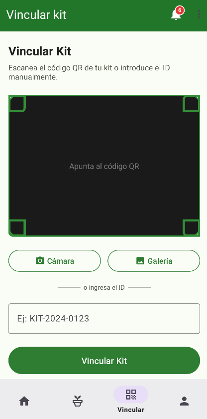
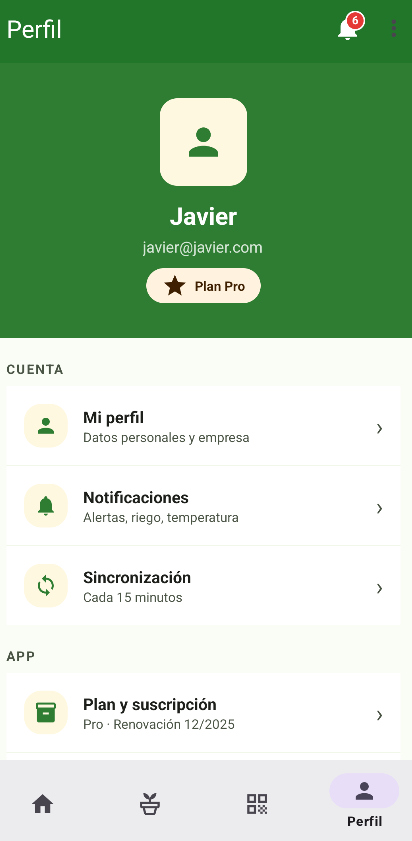
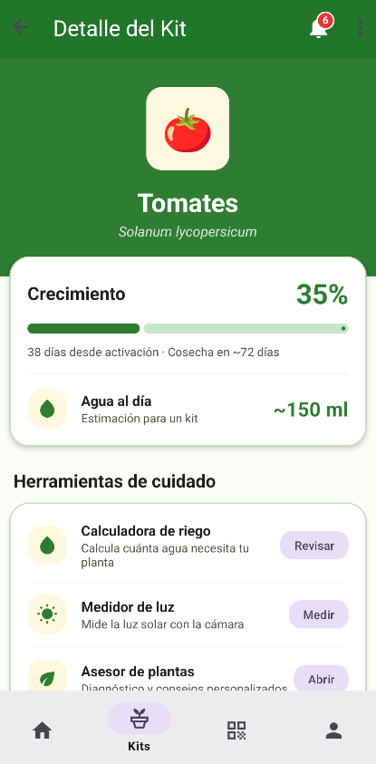
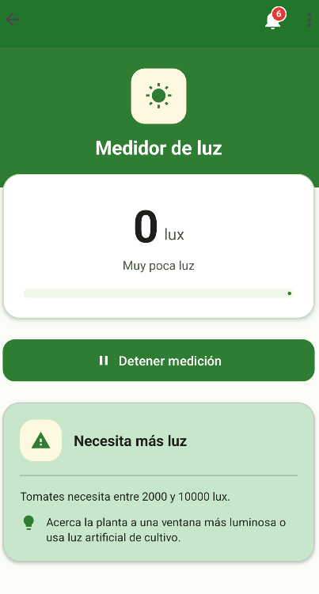
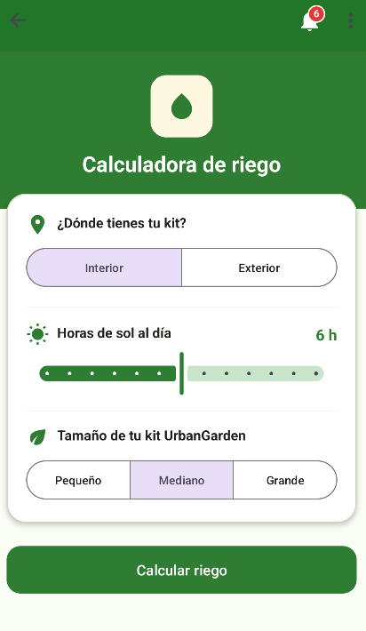
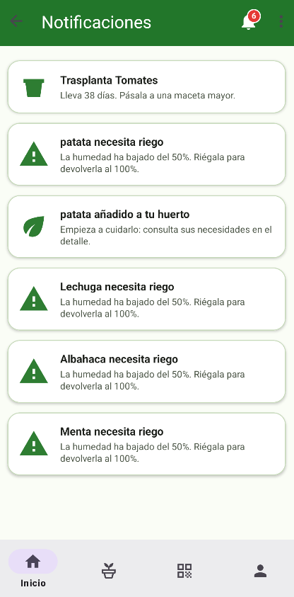
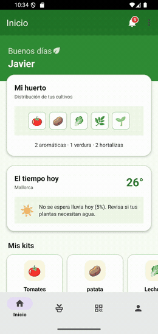

# UrbanGarden 🌱

Aplicación **Android nativa (Java)** para la gestión de **kits de huerto urbano**: cada usuario vincula sus kits físicos (por QR o ID), realiza el seguimiento del crecimiento de sus plantas en tiempo real y dispone de un conjunto de herramientas de cuidado (riego, luz, poda, trasplante) y avisos generados automáticamente.

Proyecto desarrollado como trabajo de fin del ciclo **DAM** (Desarrollo de Aplicaciones Multiplataforma). El código está documentado en español y estructurado por capas (UI / modelo / datos) para facilitar su lectura.

> **Idea principal del producto:** UrbanGarden comercializa kits de cultivo (maceta + sustrato + semillas) identificados por un código único. El cliente lo escanea con la app, que registra la activación del kit y le da soporte durante el ciclo de cultivo hasta la cosecha.

---

## Índice

- [Capturas](#capturas)
- [Funcionalidades](#funcionalidades)
- [Lógica de dominio](#lógica-de-dominio)
- [Pantallas en detalle](#pantallas-en-detalle)
- [Arquitectura](#arquitectura)
- [Tecnologías](#tecnologías)
- [Puesta en marcha](#puesta-en-marcha)
- [Modelo de datos en Firestore](#modelo-de-datos-en-firestore)
- [Estructura del proyecto](#estructura-del-proyecto)
- [Autoría](#autoría)

---

## Capturas

<table>
  <tr align="center">
    <td align="center"><br/><sub><b>Inicio</b> · tiempo y mis kits</sub></td>
    <td align="center"><br/><sub><b>Mis kits</b> · listado de kits</sub></td>
    <td align="center"><br/><sub><b>Vincular kit</b> · QR / ID</sub></td>
    <td align="center"><br/><sub><b>Perfil</b> · cuenta y sesión</sub></td>
  </tr>
  <tr>
    <td align="center"><br/><sub><b>Detalle del kit</b> · progreso del ciclo</sub></td>
    <td align="center"><br/><sub><b>Medidor de luz</b> · sensor del dispositivo</sub></td>
    <td align="center"><br/><sub><b>Calculadora de riego</b></sub></td>
    <td align="center"><br/><sub><b>Notificaciones</b> · avisos in-app</sub></td>
  </tr>
</table>

<p align="center"><sub>Recorrido por la app: inicio, kits, Qr, perfil, calculadora de riego, medidor de luz, notificaciones y transplante.</sub></p>
<p align="center"></p>

---

## Funcionalidades

| Área | Descripción |
|------|----------|
| **Autenticación** | Registro e inicio de sesión con **Firebase Authentication** (email + contraseña), reanudación automática de sesión, validación de formularios y traducción de los errores de Firebase a mensajes en español. |
| **Inicio (Home)** | Cabecera con el nombre del usuario, tarjeta **"Mi huerto"** (esquema visual + resumen por categorías), tarjeta **"El tiempo hoy"** con recomendación de riego, y carrusel **"Mis kits"**. |
| **Gestión de kits** | Listado de kits con riego rápido, alta por **QR** o **ID manual**, ficha de detalle, edición y borrado. El acceso a los kits está aislado por usuario. |
| **Estado calculado** | El progreso del cultivo y la humedad se derivan **del tiempo transcurrido**, sin persistir valores intermedios en la base de datos. |
| **Herramientas de cuidado** | Calculadora de riego, medidor de luz (sensor del dispositivo), asesor premium, guía de poda y guía de trasplante. |
| **Avisos** | Notificaciones in-app derivadas del estado de cada kit, con contador (badge) en la barra superior. |
| **Sincronización** | Los cambios en Firestore se propagan a todas las pantallas mediante `LiveData` y *snapshot listeners*. |

---

## Lógica de dominio

La clase [`Kit`](app/src/main/java/com/app/urbangarden/model/Kit.java) no almacena estados intermedios, sino que los **deriva en tiempo de lectura** a partir de las marcas temporales persistidas:

- **Edad real** (`getDiasReales`): días transcurridos desde la activación más la edad base de siembra.
- **Progreso del ciclo** (`getProgresoReal`): valor 0–100 % interpolado sobre un ciclo de **110 días** (`DIAS_CICLO_COMPLETO`). Alimenta la barra de progreso de la ficha de detalle.
- **Humedad real** (`getHumedadReal`): parte del 100 % tras el último riego y **decae linealmente hasta 0 % en 24 h** (`ParametrosRiego.INTERVALO_RIEGO_BASE_HORAS`).
- **Necesidad de riego** (`necesitaRiego`): verdadero cuando la humedad real cae por debajo del **50 %**.
- **Riego** (`regar`): restablece la humedad al 100 % y reinicia la referencia temporal del decaimiento.

Al derivar el estado de las fechas, los valores evolucionan de forma consistente entre sesiones sin necesidad de tareas en segundo plano ni actualizaciones programadas: las plantas progresan y consumen humedad únicamente en función del tiempo.

---

## Pantallas en detalle

### Login / Registro — `LoginActivity`
Pantalla única con dos vistas conmutables (login / registro). Valida email y contraseña, delega la autenticación en `SesionManager` (Firebase Auth) y, si existe una sesión activa, navega directamente a la app. El cierre de sesión está centralizado en `LoginActivity.cerrarSesion()`, que además descarta el repositorio del usuario actual para que el siguiente inicio de sesión cargue sus propios kits.

### Inicio — `HomeFragment`
- **Cabecera** con el nombre del usuario (display name de Firebase).
- **Mi huerto:** representa un emoji por kit y un resumen agregado por categoría (p. ej. *"2 aromáticas · 1 hortaliza"*).
- **El tiempo hoy:** consume la API **Open-Meteo** (sin clave) en un hilo en segundo plano y emite una recomendación de riego. Ubicación **fija (Mallorca)** en esta versión. Incluye **caché de 30 min** y **3 reintentos** ante fallos de red.
- **Mis kits:** carrusel horizontal actualizado por observación del `LiveData` del repositorio.

### Listado de kits — `KitsFragment`
Listado completo con acción **"Regar ahora"** por tarjeta (persiste en Firestore) y un **FAB** para dar de alta nuevos kits (navega a la pantalla de vinculación). La lista se actualiza por observación del `LiveData`, sin `notifyDataSetChanged` manual ni recarga en `onResume`.

### Vinculación de kit (QR) — `QrFragment`
Dos vías de alta:
1. **Escaneo QR** con la cámara (librería **ZXing**, `zxing-android-embedded`).
2. **ID manual** con validación de formato (`KIT-2024-0123`).

El ID se consulta en la colección **`catalogo`** de Firestore; si existe, el kit de catálogo se copia a los kits del usuario y se registra su fecha de activación. Se controlan los duplicados y el caso de ID inexistente.

### Detalle del kit — `DetalleKitFragment`
Ficha de una planta (recibe únicamente el **ID** y observa el repositorio):
- Cabecera con emoji, nombre y especie.
- **Barra de progreso** del ciclo (estado calculado), días desde la activación y estimación de cosecha.
- Agua diaria recomendada.
- Acceso a las **5 herramientas** de cuidado.
- **Edición** (nombre y especie mediante diálogo construido en código) y **borrado** con confirmación.

### Calculadora de riego — `CalculadoraRiegoFragment`
Estima el agua diaria (ml) a partir de la **ubicación** (interior/exterior), las **horas de sol** (slider) y el **tamaño del kit** (pequeño / mediano / grande → 0,5 / 1,5 / 3 L de sustrato). El cálculo reside en [`ParametrosRiego.mlAlDia`](app/src/main/java/com/app/urbangarden/model/ParametrosRiego.java), que aplica factores de corrección por insolación y por exposición exterior. La acción **"Registrar riego"** riega el kit y persiste el valor de agua/día calculado en Firestore.

### Medidor de luz — `MedidorLuzFragment`
Emplea el **sensor de luz del dispositivo** (`Sensor.TYPE_LIGHT`) para leer la iluminancia en **lux** en tiempo real. Muestra el nivel cualitativo, una barra de intensidad y un **veredicto** frente al rango óptimo (2 000–10 000 lux, definido en `ParametrosLuz`) con su recomendación asociada. Si el dispositivo carece de sensor de luz, lo detecta y deshabilita la medición. El sensor se libera al abandonar la pantalla para no consumir batería.

### Guía de poda — `PodaFragment`
Pantalla informativa estática (criterios y pasos de poda), independiente de la especie.

### Guía de trasplante — `TrasplanteFragment`
Compara la edad real del kit con el umbral de trasplante (**35 días**, `DIAS_TRASPLANTE`) para determinar si procede, permite **marcar el kit como trasplantado** (persistente) y presenta la guía de pasos.

### Asesor premium — `AsesorFragment`
Pantalla del modelo **freemium**. No integra pago real (requeriría Google Play Billing); representa el punto de entrada a la suscripción.

### Notificaciones — `NotificationsFragment`
Avisos **in-app** (no push del sistema) derivados **en tiempo de ejecución** por [`GeneradorNotificaciones`](app/src/main/java/com/app/urbangarden/data/GeneradorNotificaciones.java) a partir del estado de los kits. No se persisten: se recalculan por observación del `LiveData`. Reglas:

| Condición | Aviso |
|-----------|-------|
| Humedad real < 50 % | Riego pendiente |
| Progreso ≥ 95 % | Listo para cosechar |
| Edad ≥ 35 días y sin trasplantar | Trasplante recomendado |
| Edad ≤ 2 días | Kit recién añadido |

El total se muestra como **badge** sobre el icono de campana del toolbar (oculto si es 0, "9+" por encima de 9). Al pulsar un aviso, la navegación se resuelve según su tipo (listado de kits, detalle o herramienta de trasplante).

### Perfil — `PerfilFragment`
Muestra los datos del usuario (nombre y email de Firebase) y las opciones de cuenta, incluido el cierre de sesión.

---

## Arquitectura

Arquitectura por capas con la UI desacoplada de la capa de datos mediante observación reactiva (`LiveData`):

```
        ┌─────────────────────────────────────────────┐
        │                    UI                        │
        │  Activities (Login, Main) + Fragments (ui/)  │
        │  ViewBinding · Navigation Component          │
        └───────────────┬─────────────────────────────┘
                        │ observa LiveData
        ┌───────────────▼─────────────────────────────┐
        │                  DATOS (data/)               │
        │  KitRepository (singleton, Firestore)        │
        │  SesionManager (Firebase Auth)               │
        │  TiempoService (REST Open-Meteo, hilos)      │
        │  GeneradorNotificaciones (estado derivado)   │
        └───────────────┬─────────────────────────────┘
                        │
        ┌───────────────▼─────────────────────────────┐
        │                MODELO (model/)               │
        │  Kit · Notificacion · ParametrosRiego ·      │
        │  ParametrosLuz                               │
        └─────────────────────────────────────────────┘
```

**Decisiones de diseño relevantes:**
- `KitRepository` es un **singleton** con un *snapshot listener* de Firestore que publica un `LiveData<List<Kit>>`. Toda la UI consume esa misma fuente, de modo que cada cambio se propaga a las pantallas activas de forma simultánea.
- Entre pantallas **se transfiere únicamente el ID del kit**, no el objeto: cada pantalla resuelve el kit contra el repositorio y opera siempre sobre la versión vigente.
- **Navegación:** grafo único (`mobile_navigation.xml`) con `BottomNavigationView`. La selección de pestaña reposiciona en la raíz de la sección (comportamiento centralizado en `MainActivity`).
- Los getters calculados de `Kit` se anotan con `@Exclude` para excluirlos de la serialización de Firestore.

---

## Tecnologías

- **Lenguaje:** Java 11
- **Plataforma:** Android — `minSdk 24` · `targetSdk 36` · `compileSdk 36`
- **UI:** Material 3, **ViewBinding**, **Navigation Component** + `BottomNavigationView`, `RecyclerView`
- **Backend:** **Firebase** (BoM 33.7.0)
  - **Cloud Firestore** — persistencia de kits y catálogo, con sincronización en tiempo real.
  - **Firebase Authentication** — cuentas con email/contraseña.
- **API REST:** [Open-Meteo](https://open-meteo.com/) (sin clave) mediante `HttpURLConnection` y parseo manual de JSON.
- **Sensores:** sensor de luz (`Sensor.TYPE_LIGHT`).
- **QR:** [ZXing](https://github.com/journeyapps/zxing-android-embedded) `zxing-android-embedded:4.3.0`.
- **Build:** Gradle (Kotlin DSL) con *version catalog* (`libs.versions.toml`).

---

## Puesta en marcha

### Requisitos
- Android Studio (versión reciente) con un emulador o dispositivo **API 24+**.
- Un proyecto de **Firebase** propio (la app requiere Firestore y Authentication).

### Pasos

```bash
git clone https://github.com/jibarra2508c/UrbanGarden.git
# Abrir la carpeta en Android Studio
```

1. Crear un proyecto en la [consola de Firebase](https://console.firebase.google.com/).
2. Registrar una app Android con el *package* `com.app.urbangarden`.
3. Habilitar **Authentication → Email/Password** y aprovisionar una base de datos **Cloud Firestore**.
4. Descargar el `google-services.json` propio desde la consola y ubicarlo en `app/`. *(El repositorio **no** incluye un `google-services.json` real; se aporta una plantilla `app/google-services.json.example` que puedes copiar a `app/google-services.json` y rellenar con los datos de tu proyecto.)*
5. (Recomendado) Poblar la colección `catalogo` con kits de prueba para habilitar la vinculación por QR/ID — ver [modelo de datos](#modelo-de-datos-en-firestore).
6. Compilar y ejecutar en el emulador o dispositivo.

> **Permisos:** la app declara únicamente `INTERNET` (tiempo y Firebase) y accede a la cámara a través del flujo de ZXing.

---

## Modelo de datos en Firestore

```
usuarios/{uid}/kits/{idKit}        ← kits de cada usuario (aislados por uid)
catalogo/{idKit}                   ← kits de catálogo que se vinculan al escanear
```

Cada documento de kit se mapea automáticamente a la clase `Kit`. Campos persistidos (los calculados quedan excluidos):

| Campo | Tipo | Descripción |
|-------|------|-------------|
| `nombre` | String | Nombre asignado por el usuario |
| `especie` | String | Especie (p. ej. *Albahaca*) |
| `tipo` | String | Categoría: aromática / hortaliza / verdura… |
| `emoji` | String | Emoji para el esquema del huerto |
| `fechaActivacion` | Date | Instante de vinculación del kit |
| `fechaUltimoRiego` | Date | Referencia para el decaimiento de humedad |
| `humedad` | int | Humedad base (0–100) del último riego |
| `horasLuz`, `temperatura`, `diasEdad` | num | Parámetros base de la planta |
| `trasplantado` | boolean | Marca de trasplante realizada por el usuario |
| `mlAlDia` | int | Agua diaria calculada (0 = sin calcular) |

Para habilitar la vinculación, `catalogo` debe contener documentos cuyo **ID** coincida con el del kit (formato `KIT-AAAA-NNNN`).

---

## Estructura del proyecto

```
app/src/main/java/com/app/urbangarden/
├── LoginActivity.java          # Login/registro (Firebase Auth) + logout central
├── MainActivity.java           # Host de navegación, toolbar y badge de avisos
│
├── data/                       # Capa de datos
│   ├── KitRepository.java          # Singleton Firestore + LiveData (tiempo real)
│   ├── SesionManager.java          # Firebase Authentication
│   ├── TiempoService.java          # REST Open-Meteo en hilo de fondo + caché
│   └── GeneradorNotificaciones.java# Avisos derivados del estado de los kits
│
├── model/                      # Modelo de dominio
│   ├── Kit.java                    # Entidad + estado calculado (progreso/humedad)
│   ├── Notificacion.java           # Aviso in-app (con su tipo)
│   ├── ParametrosRiego.java        # Cálculo de agua/día
│   └── ParametrosLuz.java          # Rango óptimo de luz y veredicto
│
└── ui/                         # Una carpeta por pantalla (Fragment + Adapter)
    ├── home/ · kits/ · detalleKit/
    ├── calculadoraRiego/ · medidorLuz/ · asesor/ · poda/ · trasplante/
    ├── qr/ · notifications/ · perfil/
```

---

## Autoría

**Javier Ibarra**
